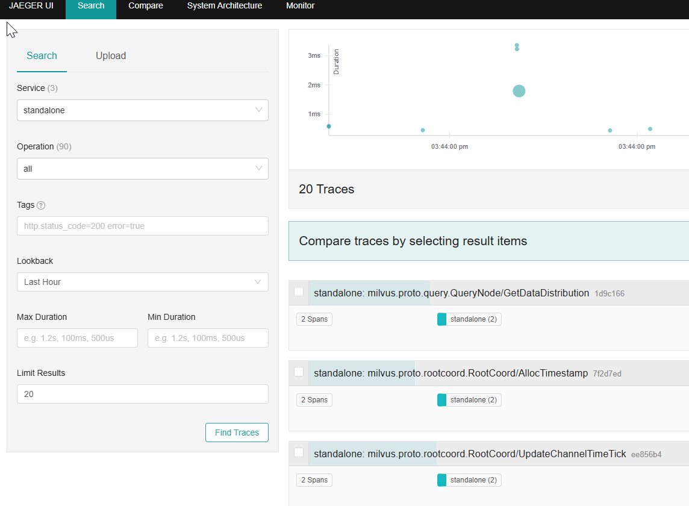
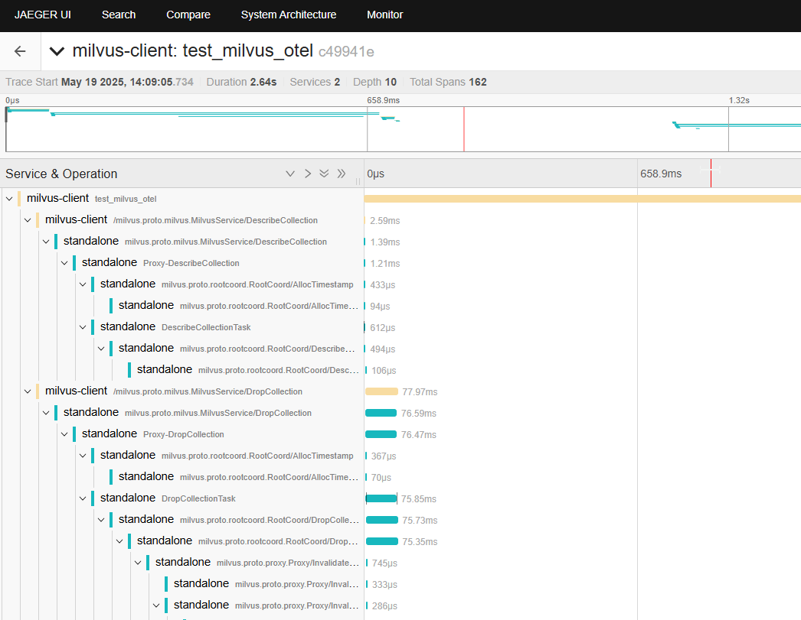

Milvus 与 OpenTelemetry 集成实战 —— Trace 功能详解
=========================================

前言
-----------------------
在现代微服务架构中，了解各个服务之间的调用链路是至关重要的。OpenTelemetry（OTEL） 提供了一种标准化的方式来收集、处理和导出应用的指标（Metrics）、日志（Logs）和追踪（Traces）。本文将重点介绍如何在 Milvus 向量数据库中集成 OTEL Trace，以实现调用链的可视化分析。

为什么选择 OTEL + Jaeger？
* OpenTelemetry 是 CNCF 支持的可观测性框架，支持多种语言。
* Jaeger 是一个流行的分布式追踪系统，能可视化调用链。
* 它们结合可以帮助开发者快速发现性能瓶颈、异常路径和系统间依赖。

* * *

一、环境准备
------

*   Milvus 2.5.11

*   Jaeger 1.46.0

*   Python 3.7+

*   Docker 和 Docker Compose

*   Python 依赖包见 `requirements.txt`


* * *

二、启动 Milvus 和 Jaeger 服务
-----------------------

使用以下 `docker-compose.yaml` 来启动 Milvus 和 Jaeger：


``` yaml
version: '3.7'
services:
  milvus:
    image: milvusdb/milvus:v2.5.11
    command: ["milvus", "run", "standalone"]
    environment:
      - ETCD_USE_EMBED=true
      - ETCD_DATA_DIR=/var/lib/milvus/etcd
      - ETCD_CONFIG_PATH=/milvus/configs/embedEtcd.yaml
      - COMMON_STORAGETYPE=local
    volumes:
      - ./embedEtcd.yaml:/milvus/configs/embedEtcd.yaml
      - ./milvus.yaml:/milvus/configs/milvus.yaml
    ports:
      - "19530:19530"
      - "9091:9091"
    healthcheck:
      test: ["CMD", "curl", "-f", "http://localhost:9091/healthz"]
      interval: 30s
      start_period: 90s
      timeout: 20s
      retries: 3
    security_opt:
      - seccomp:unconfined
    depends_on:
      - jaeger

  jaeger:
    image: jaegertracing/all-in-one:1.46.0
    ports:
      - "16686:16686"  # Jaeger UI
      - "4317:4317"    # OTLP gRPC receiver
      - "4318:4318"    # OTLP HTTP receiver
      - "5778:5778"    # Jaeger agent configs
      - "9411:9411"    # Zipkin compatible endpoint
    environment:
      - COLLECTOR_OTLP_ENABLED=true
```
> 注意：`embedEtcd.yaml` 和 `milvus.yaml` 配置文件可参考 https://github.com/topikachu/milvus-py-otel 示例。
其中 `milvus.yaml` 启用了 Trace 配置：
``` yaml
trace:
  exporter: otlp
  sampleFraction: 1
  otlp:
    endpoint: jaeger:4317
    method: grpc
    secure: false
  initTimeoutSeconds: 10
```
启动服务：

```bash
docker-compose up -d
```
### 验证 Milvus standalone 的 Trace 是否成功发送到 Jaeger

在成功执行 `docker-compose up -d` 启动服务后，可以通过以下方式验证 Milvus standalone 是否已将 Trace 数据发送到 Jaeger：

1. 打开浏览器，访问 Jaeger UI：`http://localhost:16686/search`


2. 在左上角的 **“Search”** 面板中，点击下拉框 **“Service”**，查找并选择 `standalone`。

如果你看到名为 `standalone` 的服务，说明 Milvus 内部的 OpenTelemetry 配置已生效，Trace 数据已成功发送至 Jaeger。

3. 点击 “Find Traces”，你将看到 Milvus 内部产生的 Trace 链路，例如组件间 gRPC 调用。


如果没有看到 Trace 数据：

- 确保 `milvus.yaml` 配置文件中的 `trace` 配置正确，且 Jaeger 正常运行。
- 检查 `milvus`容器中是否有 Trace 初始化失败的错误日志。
- 等待几秒钟再刷新 Jaeger UI，Trace 上报可能有短暂延迟。

* * *

三、Python 客户端环境与依赖
-----------------

创建 `requirements.txt`：

``` ini
opentelemetry-api==1.33.1
opentelemetry-sdk==1.33.1
opentelemetry-exporter-otlp==1.33.1
opentelemetry-instrumentation-grpc==0.54b1
opentelemetry-exporter-otlp-proto-grpc==1.33.1
pymilvus==2.5.9
```

安装依赖：


``` bash
pip install -r requirements.txt
```

* * *

四、Python 端 OpenTelemetry 初始化示例
------------------------------

``` python 
import os
from opentelemetry import trace
from opentelemetry.sdk.resources import Resource
from opentelemetry.sdk.trace import TracerProvider
from opentelemetry.sdk.trace.export import BatchSpanProcessor
from opentelemetry.exporter.otlp.proto.grpc.trace_exporter import OTLPSpanExporter
from opentelemetry.instrumentation.grpc import GrpcInstrumentorClient

# OTEL 环境变量配置，实际项目可改用外部环境变量。
os.environ['OTEL_EXPORTER_OTLP_ENDPOINT'] = 'http://localhost:4317'
os.environ['OTEL_SERVICE_NAME'] = 'milvus-client'

# 创建资源（服务名和自定义属性）
resource = Resource.create({
    "service.name": "milvus-client",
    "application": "milvus-otel-test"
})

# 初始化 TracerProvider 并添加 BatchSpanProcessor
trace.set_tracer_provider(
    TracerProvider(resource=resource)
)
otlp_exporter = OTLPSpanExporter()
span_processor = BatchSpanProcessor(otlp_exporter)
trace.get_tracer_provider().add_span_processor(span_processor)

# 自动为 gRPC 客户端打点
grpc_client_instrumentor = GrpcInstrumentorClient()
grpc_client_instrumentor.instrument()

# 获取 tracer 对象
tracer = trace.get_tracer(__name__)
```


* * *

五、Milvus Python 操作示例（带 Trace）
-----------------------------

``` python 
from pymilvus import MilvusClient
from opentelemetry import trace

with tracer.start_as_current_span("test_milvus_otel"):
    milvus_client = MilvusClient(
        uri="http://localhost:19530",
    )
    collection_name = "quick_setup"

    # 如果集合存在则删除
    if milvus_client.has_collection(collection_name):
        milvus_client.drop_collection(collection_name)

    # 创建集合
    milvus_client.create_collection(
        collection_name=collection_name,
        dimension=5
    )

    # 这里可继续添加更多操作
    
    milvus_client.close()
```
* * *

六、查看 Trace
----------

打开浏览器访问 Jaeger UI：
`http://localhost:16686`

选择服务 `milvus-client`，即可看到包含 Milvus 客户端调用的 Trace 数据，方便定位调用链路和性能瓶颈。

* * *

七、总结
----

通过上述步骤，我们实现了：

*   在 Milvus 服务端启用 OTEL Trace 并配置导出到 Jaeger

*   Python 客户端使用 OpenTelemetry SDK 对 gRPC 通信自动追踪

*   使用 Jaeger 可视化链路追踪信息


整个流程无需修改 Milvus SDK 代码，只需在启动时配置 OpenTelemetry，简单高效。

欢迎根据此流程进行扩展，结合日志和指标，构建完整的分布式监控方案。

* * *

附录
--

*   Milvus 官方文档：[https://milvus.io/docs](https://milvus.io/docs)

*   OpenTelemetry Python：[https://opentelemetry.io/docs/instrumentation/python/](https://opentelemetry.io/docs/instrumentation/python/)

*   Jaeger 官方文档：[https://www.jaegertracing.io/docs/](https://www.jaegertracing.io/docs/)

*   Milvus OpenTelemetry Integration Demo (Python) 示例: [https://github.com/topikachu/milvus-py-otel](https://github.com/topikachu/milvus-py-otel)

## Java 版本参考示例

如果你更熟悉 Java，也可以参考我准备的 Java 版本的 Milvus + OpenTelemetry 集成示例：

👉 [milvus-java-otel 示例项目](https://github.com/topikachu/milvus-java-otel)

该项目展示了如何通过配置 OpenTelemetry Java Agent，在无需修改业务代码的情况下，将 Milvus 客户端的操作链路信息发送至 Jaeger 进行可视化追踪。


感谢阅读！如有问题欢迎留言讨论。


* * *

